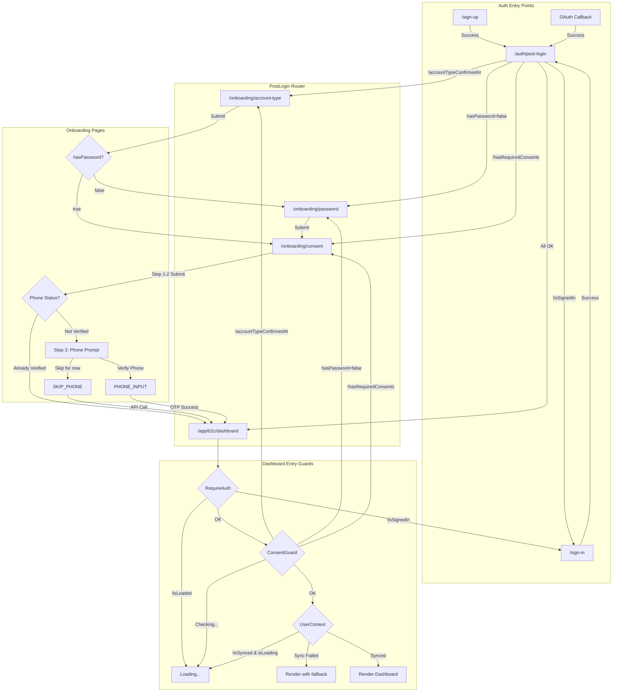

# Auth + Onboarding Flow Audit

## A) Flow Map (Current State)



### Decision Points by File

| File | Decision | Condition | Next Route |
|------|----------|-----------|------------|
| `App.tsx:103-107` | Route gate | `<RequireAuth><ConsentGuard>` | Wraps dashboard routes |
| `PostLogin/index.tsx:46-80` | Account type check | `!user.accountTypeConfirmedAt` | `/onboarding/account-type` |
| `PostLogin/index.tsx:56-60` | Password check | `user.hasPassword === false` | `/onboarding/password` |
| `PostLogin/index.tsx:63-75` | Consent check | `!hasRequiredConsents \|\| needsReConsent` | `/onboarding/consent` |
| `ConsentGuard.tsx:87-92` | Account type check | `!user.accountTypeConfirmedAt` | `/onboarding/account-type` |
| `ConsentGuard.tsx:100-106` | Password check | `user.hasPassword === false` | `/onboarding/password` |
| `ConsentGuard.tsx:130-140` | Consent check | `needsConsent` | `/onboarding/consent` |
| `AccountTypePage/index.tsx:40-47` | Redirect if complete | `user.accountTypeConfirmedAt` | password or consent |
| `AccountTypePage/index.tsx:54-68` | After submit | Always | password or consent |
| `PasswordPage/index.tsx:35-49` | Guards | Various | account-type or consent |
| `ConsentPage/index.tsx:53-65` | Account type gate | `!user.accountTypeConfirmedAt` | `/onboarding/account-type` |
| `ConsentPage/index.tsx:140-156` | Already has consent | `hasRequiredConsents && !needsReConsent` | returnTo or dashboard |
| `ConsentPage/index.tsx:272-305` | Skip phone | After API success | returnTo or dashboard |
| `RequireRole.tsx:38-70` | Auth + Role | `!isLoaded \|\| isLoading \|\| !isSynced` | Loading state |

---

## B) Duplicated / Contradictory Logic

### Duplications (Same Decision in Multiple Places)

1. **"Next onboarding route" computed in 5+ places:**
   - `PostLogin/index.tsx` (lines 46-80)
   - `ConsentGuard.tsx` (lines 87-150)
   - `AccountTypePage/index.tsx` (lines 40-68)
   - `PasswordPage/index.tsx` (lines 35-58)
   - `ConsentPage/index.tsx` (lines 53-65, 243-260)

2. **"Account type check" in 4 places:**
   - `PostLogin/index.tsx:48`
   - `ConsentGuard.tsx:90`
   - `PasswordPage/index.tsx:37`
   - `ConsentPage/index.tsx:56`

3. **"Password required check" in 3 places:**
   - `PostLogin/index.tsx:56`
   - `ConsentGuard.tsx:100`
   - `AccountTypePage/index.tsx:41, 60`

### Contradictions

1. **`returnTo` handling is inconsistent:**
   - `PostLogin` hardcodes `returnTo: '/app/b2c/dashboard'` for account-type (line 50)
   - `PasswordPage` redirects to consent without preserving `returnTo` (line 58)
   - `ConsentGuard` uses `location.pathname + location.search` but loses on OAuth redirect

2. **Progress indicators don't match:**
   - `AccountTypePage`: "Step 1 of 3" (3 dots)
   - `PasswordPage`: "Step 1 of 2" (2 dots) 
   - `ConsentPage`: 3 dots always, but comments say "3 or 4 dots based on password step"

3. **Different "sync" behaviors:**
   - `RequireRole` blocks on `isSynced` (line 47)
   - `ConsentGuard` doesn't check `isSynced`
   - Can cause: Dashboard navigation works, but render blocked by RequireRole

### Loop Risks

1. **Dashboard → ConsentGuard → Consent loop:**
   - If `getConsentStatus()` throws or returns error shape
   - `ConsentGuard` redirects to `/onboarding/consent`
   - `ConsentPage` checks consent and may redirect back if API inconsistent

2. **Skip phone "stuck" scenario:**
   - User clicks "Skip for now"
   - API call succeeds, navigation to dashboard occurs
   - `RequireRole` blocks because `UserContext.isSynced` is false
   - User sees infinite loading

---

## C) UX Audit: Onboarding Progress + Copy

### Step Count Inconsistencies

| Page | Visual Dots | Text | Actual Steps |
|------|-------------|------|--------------|
| AccountTypePage | 3 | "Step 1 of 3" | Correct for email signup |
| PasswordPage | 2 | "Step 1 of 2" | Should be "Step 2 of 3" |
| ConsentPage | 3 | No step text | Steps 1-3 within consent |

### Issues Found

1. **PasswordPage shows wrong step count:**
   - File: `PasswordPage/index.tsx:89-94`
   - Shows: "Step 1 of 2" with 2 dots
   - Should be: "Step 2 of 3" with 3 dots (account-type → password → consent)

2. **ConsentPage reuses wrong translation key:**
   - File: `ConsentPage/index.tsx:528-531` (Privacy checkbox)
   - Uses: `t('consent.step1.agreeToTerms')` for privacy policy
   - Should be: `t('consent.step1.agreeToPrivacy')` or distinct key

3. **"Maybe Later" behavior is confusing:**
   - File: `ConsentPage/index.tsx:553-562`
   - Action: Signs user OUT and redirects to landing
   - Expected by users: Skip consent, continue to dashboard
   - Should be: Renamed to "Sign Out" or behavior changed

4. **"Skip for now" hint text mismatch:**
   - File: `ConsentPage/index.tsx:709`
   - Says: "verify later from your dashboard to claim free credits"
   - But: After skip, user goes to dashboard without refresh prompt

### Recommended Copy Changes

```tsx
// PasswordPage: Fix step indicator
// Before:
<span>{t('onboarding.step', 'Step')} 1 {t('onboarding.of', 'of')} 2</span>

// After:
<span>{t('onboarding.step', 'Step')} 2 {t('onboarding.of', 'of')} 3</span>
// And update dots from 2 to 3
```

---

## D) Skip Phone Bug: End-to-End Trace

### Frontend Flow

1. **User clicks "Skip for now"** 
   - File: `ConsentPage/index.tsx:681`
   - Calls: `handleSkipPhone()`

2. **handleSkipPhone function** (lines 274-305):
   ```tsx
   const handleSkipPhone = async () => {
     setIsSkipping(true);
     setSkipError(null);
     
     const result = await apiService.skipPhoneForCredits();
     if (!result.success) {
       setSkipError(result.error);
       setIsSkipping(false);
       return; // ❌ STAYS ON PAGE
     }
     
     clearConsentCache();
     navigate(returnTo, { replace: true }); // → Dashboard
   }
   ```

3. **API Call**: `apiService.skipPhoneForCredits()`
   - File: `APIService.ts:3418-3455`
   - Endpoint: `POST /api/phone/skip-for-credits`
   - Uses: `credentials: 'include'`

### Backend Flow

4. **Backend handler**: `phoneRoutes.ts:115-128`
   ```typescript
   router.post('/skip-for-credits', requireSession, async (req, res) => {
     const userId = req.userId!;
     const success = await phoneVerificationService.skipPhoneVerificationForCredits(userId);
     
     if (!success) {
       return res.status(400).json({ status: 'error', message: 'Failed' });
     }
     return res.json({ status: 'success', message: 'Skip preference recorded' });
   });
   ```

5. **Service function**: `phoneVerificationService.ts:630-645`
   ```typescript
   export async function skipPhoneVerificationForCredits(userId: string): Promise<boolean> {
     await redisService.set(
       PHONE_SKIP_FOR_CREDITS_KEY(userId),
       { skipped: true, skippedAt: new Date().toISOString() },
       PHONE_SKIP_FOR_CREDITS_TTL_SECONDS // 30 days
     );
     return true;
   }
   ```

### Guards After Navigation

6. **Navigation to `/app/b2c/dashboard`**
   - Wrapped in: `<RequireAuth><ConsentGuard><LoggedLayout /></ConsentGuard></RequireAuth>`

7. **RequireAuth** (`RequireRole.tsx:38-70`):
   ```tsx
   const { isLoaded, isSignedIn } = useUser();
   const { isLoading, dbUser, isSynced } = useUserContext();
   
   // CRITICAL: Blocks on isSynced!
   if (!isLoaded || isLoading || (isSignedIn && !isSynced)) {
     return <Loading />; // ❌ STUCK HERE
   }
   ```

8. **UserContext sync state** (`UserContext.tsx:196-215`):
   - If `validateUser()` fails → `isSynced` stays `false`
   - `syncAttemptedRef.current = false` allows retry
   - But no automatic retry mechanism!

---

## E) Hypothesis Confirmation

### ✅ CONFIRMED: Hypothesis 1 (Most Likely)

**"Navigation to dashboard occurs but RequireAuth blocks because UserContext.isSynced stays false"**

**Evidence:**
1. `handleSkipPhone` calls `navigate(returnTo)` after API success (line 299)
2. Dashboard is wrapped in `RequireAuth` which checks `isSynced` (RequireRole.tsx:47)
3. `UserContext` only attempts sync once on mount (line 159: `if (syncAttemptedRef.current) return`)
4. If initial sync failed, `isSynced` is `false` and user sees infinite loading
5. `clearConsentCache()` is called but `UserContext` cache is NOT invalidated

**Root Cause:**
After skip phone, navigation occurs, but:
- `UserContext` was already mounted and synced (or failed)
- No mechanism to re-trigger sync after consent/phone changes
- `RequireAuth` blocks rendering because `isSynced` may be stale

### ❌ LESS LIKELY: Hypothesis 2 (Redirect Loop)

**Evidence Against:**
- `ConsentGuard` only checks `getConsentStatus()`, not phone status
- Skip phone doesn't change consent status
- If consent was already recorded in Step 2, guard should pass

**However:** If `getConsentStatus()` returns non-JSON (proxy error), loop could occur.

---

## F) Fix Plan

### Root Cause Fix

The issue is that `UserContext.isSynced` may be stale, and `RequireAuth` blocks on it.

**Fix 1: Don't block on isSynced in RequireAuth**

```tsx
// RequireRole.tsx - Change line 47
// Before:
if (!isLoaded || isLoading || (isSignedIn && !isSynced)) {
  return <Loading />;
}

// After: Remove isSynced check, allow rendering with degraded state
if (!isLoaded || (isLoading && !isSynced)) {
  return <Loading />;
}
```

**Fix 2: Invalidate UserContext after skip**

```tsx
// ConsentPage - handleSkipPhone
import { useUserContext } from 'contexts/UserContext';

const { invalidateCache: invalidateUserCache } = useUserContext();

const handleSkipPhone = async () => {
  // ... API call ...
  
  clearConsentCache();
  invalidateUserCache(); // NEW: Clear user cache
  
  navigate(returnTo, { replace: true });
};
```

**Fix 3: Add timeout to sync loading state**

```tsx
// UserContext.tsx - Add timeout for sync
useEffect(() => {
  const validateAndSyncUser = async () => {
    // ... existing code ...
  };
  
  validateAndSyncUser();
  
  // Timeout: if sync takes > 10s, allow proceeding
  const timeout = setTimeout(() => {
    if (!isSynced && isLoading) {
      console.warn('⚠️ User sync timed out, proceeding anyway');
      setIsLoading(false);
      setIsSynced(true); // Allow proceeding
    }
  }, 10000);
  
  return () => clearTimeout(timeout);
}, [isLoaded, isSignedIn, user?.id]);
```

---

## G) Implementation: Single Source of Truth

See: `src/lib/onboarding/` module (to be created)

### Files to Create

1. `src/lib/onboarding/routes.ts` - Centralized route constants
2. `src/lib/onboarding/steps.ts` - Step metadata
3. `src/lib/onboarding/getNextRoute.ts` - Decision function
4. `src/lib/onboarding/index.ts` - Barrel export

### Files to Modify

1. `ConsentGuard.tsx` - Use `getNextOnboardingRoute()`
2. `PostLogin/index.tsx` - Use `getNextOnboardingRoute()`
3. `AccountTypePage/index.tsx` - Use step metadata
4. `PasswordPage/index.tsx` - Use step metadata
5. `ConsentPage/index.tsx` - Use step metadata + fix skip behavior
6. `RequireRole.tsx` - Remove `isSynced` blocking

---

## H) Test Plan Checklist

### Happy Path Tests

- [ ] Fresh email signup → account-type → password → consent → dashboard
- [ ] OAuth signup (Google) → account-type → password → consent → dashboard
- [ ] Skip phone verification → lands on dashboard (no loop)
- [ ] Complete phone verification → lands on dashboard
- [ ] Existing user sign-in (onboarding complete) → dashboard directly

### Edge Case Tests

- [ ] Consent API fails → user sees error, can retry
- [ ] UserContext sync fails → user can still access dashboard (degraded)
- [ ] returnTo preserved: /account while logged out → login → onboarding → /account
- [ ] Browser refresh mid-onboarding → resumes at correct step
- [ ] Back button from password → account-type → can proceed forward again

### Regression Tests

- [ ] ConsentGuard doesn't loop after consent submitted
- [ ] PasswordPage shows correct step count (2 of 3)
- [ ] "Maybe Later" signs user out (or behavior clarified)
- [ ] Phone skip records preference in Redis (backend)
